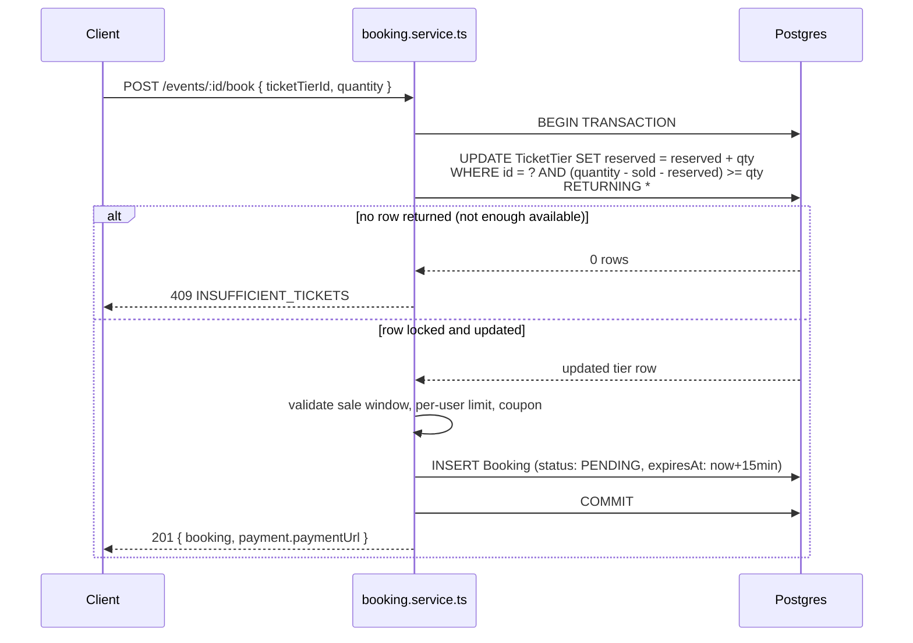
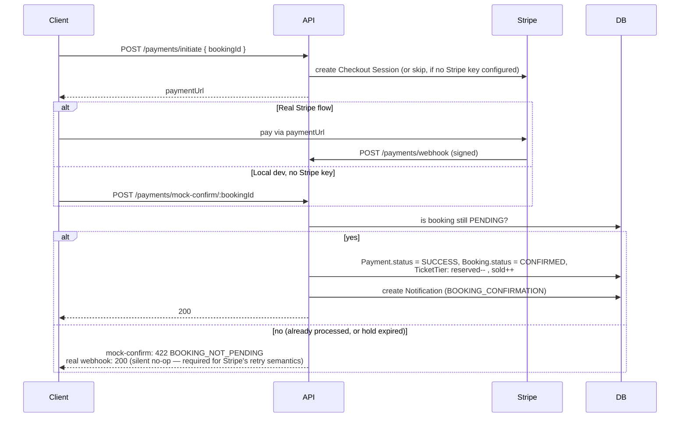
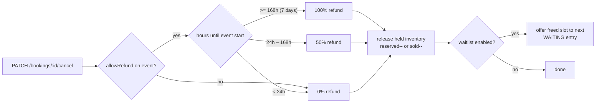
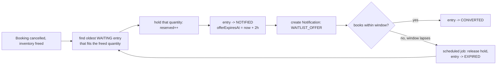
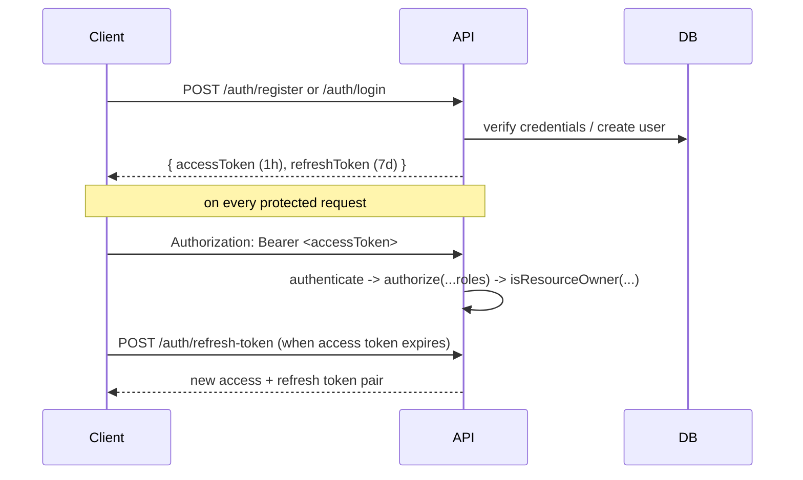

# Event Ticket Booking & Management Platform

A production-shaped backend for discovering, booking, and managing event tickets — built with **Node.js, TypeScript, Express, PostgreSQL, and Prisma 7**. Organizers create events with multiple ticket tiers (General, Early Bird, VIP, or whatever they name them), attendees book tickets with a guaranteed no-overselling checkout, and admins moderate the platform.

This README is the single entry point for understanding the whole project — what it does, how it's put together, every API endpoint, and the key flows (checkout concurrency, refunds, waitlist conversion). Deeper reference material lives in `/docs`.

---

Postman Colelction: https://www.postman.com/speeding-eclipse-199364/workspace/event-booking-platform/collection/15474628-61379b36-a23c-4d8f-b0f4-b267cf95b9bd?action=share&creator=15474628

Backend Live Link: https://event-ticket-booking-management-pla.vercel.app/

Frontend Live Link: Comming soon

Frontend github Link: Comming soon

---

## Table of Contents

1. [What This Project Does](#1-what-this-project-does)
2. [Tech Stack](#2-tech-stack)
3. [Project Structure](#3-project-structure)
4. [Data Model](#4-data-model)
5. [Setup](#5-setup)
6. [Roles & Permissions](#6-roles--permissions)
7. [API Reference — Every Endpoint](#7-api-reference--every-endpoint)
8. [Key Flows](#8-key-flows)
9. [Business Rules](#9-business-rules)
10. [Testing](#10-testing)
11. [Postman Collection](#11-postman-collection)
12. [Deploying with Supabase](#12-deploying-with-supabase)
13. [Environment Variables](#13-environment-variables)
14. [Known Environment Notes](#14-known-environment-notes)

---

## 1. What This Project Does

- **Organizers** create events, define ticket tiers with independent pricing/inventory, publish/cancel events, check attendees in at the door, and respond to reviews.
- **Attendees** discover events, book tickets (with coupons), pay, get notified, join a waitlist when a tier sells out, and leave reviews after attending.
- **Admins** moderate users (role changes, suspension), create platform-wide coupons, and see dashboard stats and a full audit trail.

The one technical requirement everything else is built around: **a sold-out ticket tier can never be oversold**, even if hundreds of people click "buy" on the last ticket at the same instant. That guarantee, and how it's implemented, is covered in detail in [§8.1](#81-checkout--the-no-overselling-guarantee).

---

## 2. Tech Stack

| Layer        | Choice                                                                                                        |
| ------------ | ------------------------------------------------------------------------------------------------------------- |
| Runtime      | Node.js ≥20.19, run via [`tsx`](https://tsx.is/) (native ESM, no separate compile step)                       |
| Framework    | Express.js                                                                                                    |
| Database     | PostgreSQL (tested against Supabase)                                                                          |
| ORM          | Prisma 7 (rust-free query compiler, custom client output, mandatory driver adapter)                           |
| Validation   | Zod                                                                                                           |
| Auth         | JWT (access + refresh), bcrypt password hashing                                                               |
| Payments     | Stripe (Checkout Sessions + webhooks), with a dev-only mock-confirm fallback when no Stripe key is configured |
| File storage | Multer + Cloudinary                                                                                           |
| Security     | helmet, cors, express-rate-limit                                                                              |
| Testing      | Vitest (unit + integration), Supertest                                                                        |
| Docs         | This README, `docs/requirements.md` (full spec w/ request/response JSON), `docs/postman_collection.json`      |

---

## 3. Project Structure

Every feature lives in its own module under `src/modules/<name>/`, each following the same file pattern:

```
src/
├── app.ts                      # Express app: middleware chain, route mounting
├── server.ts                   # Boot: DB connect, listen, graceful shutdown, background jobs
├── config/                     # env, db (Prisma client + adapter), cloudinary, stripe
├── middlewares/                # authenticate, authorize, isResourceOwner, validateRequest,
│                                #   rateLimiter, errorHandler, notFound
├── lib/
│   └── audit.ts                 # shared writeAuditLog() helper used by every module
├── utils/                      # ApiError, ApiResponse, catchAsync, jwt, password, generateCodes, logger
├── types/                      # Express Request augmentation, pagination helpers
├── jobs/
│   └── expireStaleBookings.job.ts  # cron: expires abandoned PENDING bookings + lapsed waitlist offers
├── routes/
│   └── index.ts                 # top-level route aggregator, mounts every module
├── generated/prisma/            # Prisma's generated client output (gitignored, created by `prisma generate`)
└── modules/
    ├── auth/         # register, login, refresh, logout, forgot/reset password
    ├── user/          # profile, avatar upload, change password, public profile
    ├── event/         # CRUD, publish/cancel lifecycle, search/filter/pagination
    ├── ticketTier/    # tier CRUD, committed-quantity guard
    ├── booking/       # the atomic checkout transaction, cancellation, check-in
    ├── payment/       # Stripe integration, webhook handling, dev mock-confirm
    ├── waitlist/      # join/leave, organizer view, attendee's own view, auto-conversion
    ├── review/        # checked-in-only reviews, organizer responses
    ├── coupon/        # discount validation + admin creation (pricing math is Prisma-free, unit tested)
    ├── notification/  # list, mark read
    └── admin/         # user management, dashboard stats, audit log queries

prisma/
├── schema.prisma
└── seed.ts             # demo admin/organizer/attendee + one event + Early Bird & VIP tiers + a coupon

tests/
├── unit/               # pure logic, zero DB dependency
└── integration/        # real Express app via supertest, no DB touched

docs/
├── requirements.md            # full spec: every endpoint's exact request/response JSON
├── supabase-setup.md          # pooled vs. direct connection strings, pgbouncer, troubleshooting
└── postman_collection.json    # Postman collection, auto-captures IDs/tokens
```

Within each module: **routes call controllers, controllers call services, services own all Prisma calls and business logic.** Controllers stay thin — they parse the request, call one service function, and shape the response. Anything that reaches a Prisma `create`/`update` is typed via `z.infer<typeof schema>["body"]` from that module's Zod validation schema, not a loose `Record<string, unknown>` — this is what lets Prisma's own generated types actually catch mistakes at compile time.

---

## 4. Data Model

17 models/enums, all in `prisma/schema.prisma`:

| Model          | Purpose                                                                                                                                     |
| -------------- | ------------------------------------------------------------------------------------------------------------------------------------------- |
| `User`         | One of three roles: `ATTENDEE`, `ORGANIZER`, `ADMIN`. Soft-deletable, suspendable (`isActive`).                                             |
| `Event`        | Belongs to an organizer. Lifecycle: `DRAFT → PUBLISHED → CANCELLED/COMPLETED/POSTPONED`.                                                    |
| `TicketTier`   | Belongs to an event. `sold` + `reserved` counters (see §8.1) — **not** a single "remaining" number.                                         |
| `Booking`      | Links a `User` to a `TicketTier`. Carries pricing snapshot (`unitPrice`, `discountAmount`, `finalAmount`), status, and check-in state.      |
| `Payment`      | One-to-one with `Booking`. The **single source of truth** for payment state — `Booking` deliberately has no duplicate payment-status field. |
| `Waitlist`     | Per event+tier+user. States: `WAITING → NOTIFIED → CONVERTED`/`EXPIRED`/`CANCELLED`.                                                        |
| `Review`       | One per booking (`bookingId` unique), requires the booking to have been `CHECKED_IN`. Optional organizer response.                          |
| `Coupon`       | Percentage or fixed discount, with usage limits (global + per-user), min purchase, max discount cap.                                        |
| `Notification` | In-app notifications (e.g. `BOOKING_CONFIRMATION`, `WAITLIST_OFFER`).                                                                       |
| `AuditLog`     | Every admin/organizer state-changing action, using a typed `AuditAction` enum (not free-text).                                              |

---

## 5. Setup

```bash
npm install
cp .env.example .env          # fill in DATABASE_URL / DIRECT_URL at minimum — see §12 for Supabase
npx prisma generate            # generates the client into src/generated/prisma (needs internet access)
npx prisma migrate dev --name init
npm run seed                   # optional: admin/organizer/attendee + demo event + tiers + coupon
npm run dev
```

### Scripts

| Command                                                        | What it does                                         |
| -------------------------------------------------------------- | ---------------------------------------------------- |
| `npm run dev`                                                  | Start with hot reload                                |
| `npm start`                                                    | Start without watch mode                             |
| `npm run typecheck`                                            | `tsc --noEmit`                                       |
| `npm test`                                                     | Unit tests (47 tests, no DB needed)                  |
| `npm run test:integration`                                     | HTTP-layer integration tests (8 tests, no DB needed) |
| `npm run prisma:generate` / `prisma:migrate` / `prisma:studio` | Prisma CLI shortcuts                                 |
| `npm run seed`                                                 | Populate demo data                                   |
| `npm run format`                                               | `prettier --write .`                                 |

---

## 6. Roles & Permissions

| Action                            |       Attendee       |    Organizer    |    Admin    |
| --------------------------------- | :------------------: | :-------------: | :---------: |
| Register / login                  |          ✅          |       ✅        | seeded only |
| Create/edit/publish/cancel event  |          ❌          |    ✅ (own)     |  ✅ (any)   |
| Create/edit ticket tiers          |          ❌          | ✅ (own events) |     ✅      |
| Book tickets                      |          ✅          |       ✅        |     ❌      |
| Cancel own booking                |          ✅          |       ✅        |     ✅      |
| Check in an attendee              |          ❌          | ✅ (own events) |     ✅      |
| Join / view own waitlist entries  |          ✅          |       ✅        |     ❌      |
| View an event's full waitlist     |          ❌          | ✅ (own events) |     ✅      |
| Leave a review                    | ✅ (checked-in only) |       ❌        |     ❌      |
| Respond to a review               |          ❌          | ✅ (own events) |     ✅      |
| Create a coupon                   |          ❌          |       ❌        |     ✅      |
| Manage users (role/suspend)       |          ❌          |       ❌        |     ✅      |
| View dashboard stats / audit logs |          ❌          |       ❌        |     ✅      |

---

## 7. API Reference — Every Endpoint

Base URL: `/api/v1`. Full request/response JSON bodies for every endpoint are in `docs/requirements.md`; this table is the at-a-glance index.

**Standard response envelope** — success: `{ success: true, message, data }`; paginated lists: `{ success: true, message, data: { items, pagination } }`; errors: `{ success: false, message, errors: [], code }`.

### Auth

| Method | Path                    | Auth   | Notes                                                         |
| ------ | ----------------------- | ------ | ------------------------------------------------------------- |
| POST   | `/auth/register`        | —      | `role` must be `ATTENDEE` or `ORGANIZER` (never `ADMIN`)      |
| POST   | `/auth/login`           | —      |                                                               |
| POST   | `/auth/refresh-token`   | —      |                                                               |
| POST   | `/auth/logout`          | Bearer | stateless — client-side token discard                         |
| POST   | `/auth/forgot-password` | —      | always 200 (anti-enumeration); token logged to console in dev |
| POST   | `/auth/reset-password`  | —      |                                                               |

### Users

| Method | Path                      | Auth   | Notes                                                |
| ------ | ------------------------- | ------ | ---------------------------------------------------- |
| GET    | `/users/me`               | Bearer |                                                      |
| PATCH  | `/users/me`               | Bearer |                                                      |
| POST   | `/users/me/profile-image` | Bearer | multipart, field `image`, ≤5MB                       |
| PATCH  | `/users/change-password`  | Bearer |                                                      |
| GET    | `/users/:id/profile`      | —      | public fields only                                   |
| GET    | `/users/bookings`         | Bearer | the caller's own bookings                            |
| GET    | `/users/notifications`    | Bearer | the caller's own notifications                       |
| GET    | `/users/waitlist`         | Bearer | the caller's own waitlist entries, across all events |

### Events

| Method | Path                 | Auth            | Notes                                                                      |
| ------ | -------------------- | --------------- | -------------------------------------------------------------------------- |
| POST   | `/events`            | ORGANIZER/ADMIN | created as `DRAFT`                                                         |
| GET    | `/events`            | —               | public sees `PUBLISHED` only; pass `?status=` as owner/admin to see others |
| GET    | `/events/:id`        | —               | includes tiers with computed `available`, review stats                     |
| PATCH  | `/events/:id`        | owner/ADMIN     | blocked once event has started                                             |
| PATCH  | `/events/:id/status` | owner/ADMIN     | transitioning to `CANCELLED` auto-refunds all confirmed bookings           |
| DELETE | `/events/:id`        | owner/ADMIN     | soft delete; blocked if active bookings exist <7 days out                  |

### Ticket Tiers

| Method | Path                            | Auth        | Notes                                                        |
| ------ | ------------------------------- | ----------- | ------------------------------------------------------------ |
| POST   | `/events/:eventId/ticket-tiers` | owner/ADMIN |                                                              |
| GET    | `/events/:eventId/ticket-tiers` | —           |                                                              |
| PATCH  | `/ticket-tiers/:id`             | owner/ADMIN | `quantity` can only be raised, never below `sold + reserved` |

### Bookings

| Method | Path                     | Auth                  | Notes                                      |
| ------ | ------------------------ | --------------------- | ------------------------------------------ |
| POST   | `/events/:eventId/book`  | ATTENDEE/ORGANIZER    | the atomic checkout transaction — see §8.1 |
| GET    | `/bookings/:id`          | owner/organizer/ADMIN |                                            |
| PATCH  | `/bookings/:id/cancel`   | owner/organizer/ADMIN | applies the refund policy, see §9.1        |
| POST   | `/bookings/:id/check-in` | organizer/ADMIN       | body: `{ qrCode }` = the booking number    |

### Payments

| Method | Path                                | Auth                 | Notes                                                                                                                           |
| ------ | ----------------------------------- | -------------------- | ------------------------------------------------------------------------------------------------------------------------------- |
| POST   | `/payments/initiate`                | Bearer               | idempotent                                                                                                                      |
| POST   | `/payments/webhook`                 | — (Stripe signature) | raw body, mounted before the global JSON parser                                                                                 |
| POST   | `/payments/mock-confirm/:bookingId` | Bearer               | **dev only** — disabled if `STRIPE_SECRET_KEY` is set; returns `422` (not a silent no-op) if the booking's hold already expired |
| GET    | `/payments/:id/status`              | Bearer               |                                                                                                                                 |

### Waitlist

| Method | Path                        | Auth               | Notes                                           |
| ------ | --------------------------- | ------------------ | ----------------------------------------------- |
| POST   | `/events/:eventId/waitlist` | ATTENDEE/ORGANIZER | only allowed when the tier is actually sold out |
| GET    | `/events/:eventId/waitlist` | organizer/ADMIN    | every entry for that event                      |
| GET    | `/users/waitlist`           | Bearer             | the caller's own entries only, with position    |
| DELETE | `/waitlist/:id`             | owner              |                                                 |

### Reviews

| Method | Path                       | Auth            | Notes                                          |
| ------ | -------------------------- | --------------- | ---------------------------------------------- |
| POST   | `/events/:eventId/review`  | ATTENDEE        | requires a `CHECKED_IN` booking for that event |
| GET    | `/events/:eventId/reviews` | —               | includes rating distribution                   |
| POST   | `/reviews/:id/respond`     | organizer/ADMIN | one response per review                        |

### Coupons

| Method | Path                | Auth   | Notes                             |
| ------ | ------------------- | ------ | --------------------------------- |
| POST   | `/coupons/validate` | Bearer | preview a discount before booking |
| POST   | `/admin/coupons`    | ADMIN  |                                   |

### Notifications

| Method | Path                      | Auth   | Notes                                 |
| ------ | ------------------------- | ------ | ------------------------------------- |
| GET    | `/users/notifications`    | Bearer | (listed above, repeated for grouping) |
| PATCH  | `/notifications/:id/read` | Bearer |                                       |
| PATCH  | `/notifications/read-all` | Bearer |                                       |

### Admin

| Method | Path                       | Auth  | Notes                                                |
| ------ | -------------------------- | ----- | ---------------------------------------------------- |
| GET    | `/admin/users`             | ADMIN |                                                      |
| PATCH  | `/admin/users/:id/role`    | ADMIN |                                                      |
| PATCH  | `/admin/users/:id/suspend` | ADMIN | suspended users are blocked at login and mid-session |
| GET    | `/admin/dashboard-stats`   | ADMIN |                                                      |
| GET    | `/admin/audit-logs`        | ADMIN | filterable by entity type, action, user, date range  |

**46 unique endpoints total**, comfortably above the 20-minimum requirement, every one mapping to a real capability — no filler.

---

## 8. Key Flows

### 8.1 Checkout — the no-overselling guarantee

This is the one piece of logic the whole project is built around. `POST /events/:eventId/book` runs as a single database transaction:



### 8.2 Payment confirmation



### 8.3 Cancellation & refund



Cancellation is blocked outright once the event has started, or if the booking is already `CHECKED_IN`.

### 8.4 Waitlist conversion



The expiry job (`expireLapsedWaitlistOffers`, same 60s cron as booking expiry) cascades automatically to the next person in line if an offer lapses unclaimed.

### 8.5 Auth flow



---

## 9. Business Rules

### 9.1 Refund policy (platform-wide, fixed)

| Time before event start                | Refund                        |
| -------------------------------------- | ----------------------------- |
| ≥ 7 days                               | 100%                          |
| 24 hours – 7 days                      | 50%                           |
| < 24 hours                             | 0%                            |
| Event started, or booking `CHECKED_IN` | Cancellation blocked entirely |

`Event.allowRefund = false` overrides this to 0% regardless of timing.

### 9.2 Coupon validation

A coupon must pass every check to apply: active + within its date window, global usage limit not reached, this user's own per-user limit not reached, order total meets `minPurchase`. The computed discount is capped at `maxDiscount` (if set), then capped again at the order total — a coupon can never make a booking free-and-then-some. All of this runs **inside the same transaction as the booking**, so two people can't both claim the last use of a limited coupon.

### 9.3 Soft deletes everywhere

`User`, `Event`, `TicketTier`, `Booking`, `Payment`, `Review`, `Waitlist`, `Coupon`, `Notification` all use `deletedAt` — nothing is ever hard-deleted. Every read filters `deletedAt: null` by default.

### 9.4 Audit logging

Every state-changing admin/organizer action writes an `AuditLog` row via a typed `AuditAction` enum (not free-text strings): publish/cancel an event, tier price/quantity changes, cancellations/refunds, check-ins, role changes, suspensions, coupon creation, waitlist conversions.

---

## 10. Testing

```bash
npm test                    # 47 unit tests — pure logic, zero DB dependency
npm run test:integration    # 8 integration tests — real Express app via supertest, no DB touched
```

---

## 11. Postman Collection

`docs/postman_collection.json` — Almost 55 requests across 12 folders, covering every endpoint above.

---

## 13. Environment Variables

See `.env.example` for the full annotated list. The essentials:

| Variable                                      | Required        | Notes                                                                    |
| --------------------------------------------- | --------------- | ------------------------------------------------------------------------ |
| `DATABASE_URL`                                | Yes             | Pooled connection, used at runtime                                       |
| `DIRECT_URL`                                  | Yes             | Direct connection, used only by Prisma CLI (via `prisma.config.ts`)      |
| `JWT_ACCESS_SECRET` / `JWT_REFRESH_SECRET`    | Yes             |                                                                          |
| `STRIPE_SECRET_KEY` / `STRIPE_WEBHOOK_SECRET` | No              | Leave blank in local dev to use the mock-confirm payment flow            |
| `CLOUDINARY_*`                                | No              | Only needed for profile-image upload                                     |
| `BOOKING_HOLD_MINUTES`                        | No (default 15) | How long a `PENDING` booking holds inventory before auto-expiring        |
| `WAITLIST_OFFER_HOURS`                        | No (default 2)  | How long a waitlist offer stays open before cascading to the next person |

---
